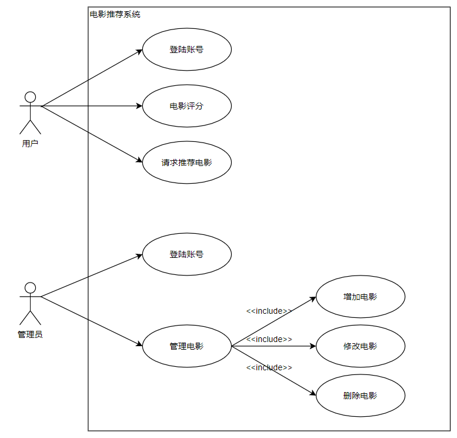
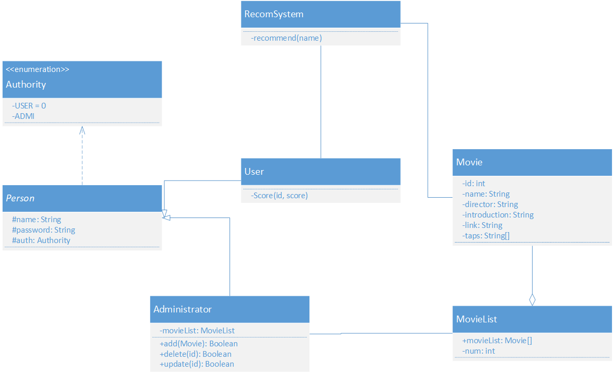
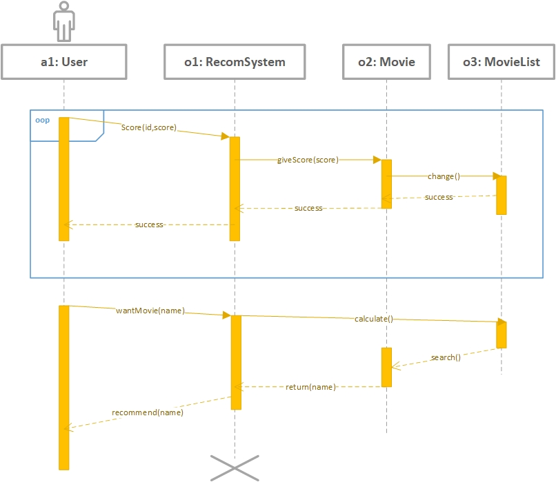
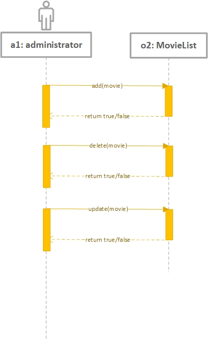

# UML建模设计说明
## 目录
  * [系统需求分析](#系统需求分析)
  * [UML建模](#uml建模)
    * [用例图](#用例图)
      * [用例图介绍](#用例图介绍)
      * [用例图分析与绘制](#用例图分析与绘制)
    * [类图](#类图)
      * [类图介绍](#类图介绍)
      * [类图分析与绘制](#类图分析与绘制)
    * [顺序图](#顺序图)
      * [顺序图介绍](#顺序图介绍)
      * [顺序图分析与绘制](#顺序图分析与绘制)

## 系统需求分析
该系统为用户个性化电影推荐系统，其基于用户对于电影的历史打分信息，向用户推荐未看过的电影。在该系统中，主要涉及三个对象：用户、管理员和电影。

- 用户：用户首先需要通过身份验证登陆该系统，然后可以在该系统中对电影进行打分，或者是请求获取系统推荐的电影列表。
- 管理员：管理员负责维护系统，其也需要通过身份验证才能登陆系统，然后可以在系统中对电影进行更新，删除或者是向系统中增加新的电影。
- 电影：电影是系统中的无行为的静态项，其拥有电影标题等描述电影自身信息的属性。

## UML建模
### 用例图
#### 用例图介绍
用例图（use case diagram）是用户与系统交互的最简表示形式，展现了用户和与他相关的用例之间的关系。通过用例图，人们可以获知系统不同种类的用户和用例。用例图也经常和其他图表配合使用。
用例图中包含以下四种关系：

| 关系类型 | 说明                  | 表示符号         |
| -------- | ----------------------- | -------------------- |
| 关联   | actor与use case之间  | 直线               |
| 泛化   | actor之间或use case之间 | 空心三角箭头   |
| 包含   | use case之间          | 虚线箭头 << include >> |
| 扩展   | use case之间          | 虚线箭头 << extend >> |

#### 用例图分析与绘制
在该系统中，存在有两个行为者（actor），分别是用户和管理员，他们都与推荐系统有交互。
- 用户：用户的操作包括三个：登陆账号，电影评分以及请求推荐电影
- 管理员：管理员的操作包括两个：登陆账号和管理电影，其中管理电影又包括（include）了增加电影、修改电影和删除电影

---
### 类图
#### 类图介绍
类图是描述类、（类或对象间的）协作、接口及其关系的图，用于详细展现系统中各个类的静态结构。类图可用于建模系统的概念及它们之间的关系。
#### 类图分析与绘制
本项目初步设计了八个类，下面分别分三类来介绍。

- 与成员用户相关的：首先是一个枚举类Authority，枚举了系统中所有人员用户的权限。接着是一个Person抽象类，作为所有人员用户的基类，其包含了用户名、密码和权限三个属性，因此和Authority类有依赖关系。继承自Person的有两个类：User和Administrator。User类是普通用户类，其包含了登录和给电影打分成员函数，对应于打分函数，每个User对象都有一个打分记录列表，是一个Score类数组，而Score类是一个只包含电影id和分数两个属性的类，被User类依赖；Administrator类是系统管理员类，其负责对系统中的电影数据库进行管理，包含了登录、增删改查等成员函数，且与MovieList类相关联。

- 与电影相关的：首先是电影类Movie，其成员属性涵盖了电影的一些重要信息，包括唯一标识符id、电影名、导演、简洁、链接和标签等。接着是系统所有电影的集合MovieList类，属性有电影列表和电影数量，该类是由电影Movie类聚合而成。

- 推荐系统类：其主要功能有验证普通用户和管理员的登录信息，以及根据用户画像，从电影列表类中给用户推荐电影。因此该类和用户类和电影集合类相关联。

---
### 顺序图
#### 顺序图介绍
顺序图是显示对象之间交互的图，这些对象是按时间顺序排列的。它显示参与交互的对象及对象之间消息交互的顺序。
#### 顺序图分析与绘制
- 用户顺序图：对用户的两个主要操作（电影评分，请求电影推荐）进行顺序图设计。在电影评分时，用户通过该系统对一部分电影进行评分，从而系统修改电影的评分信息，更新电影列表；在请求电影推荐时，用户向系统发起请求，希望系统推荐一些电影。系统调用算法，计算出和用户兴趣爱好相关的电影，得出电影名字，返回给用户。

- 管理员顺序图：对管理用的三个主要操作（增加电影、删除电影和更新电影）进行顺序图设计，具体过程为管理员向系统发送操作请求，系统在完成操作后向管理员回馈操作是否成功的信号。

